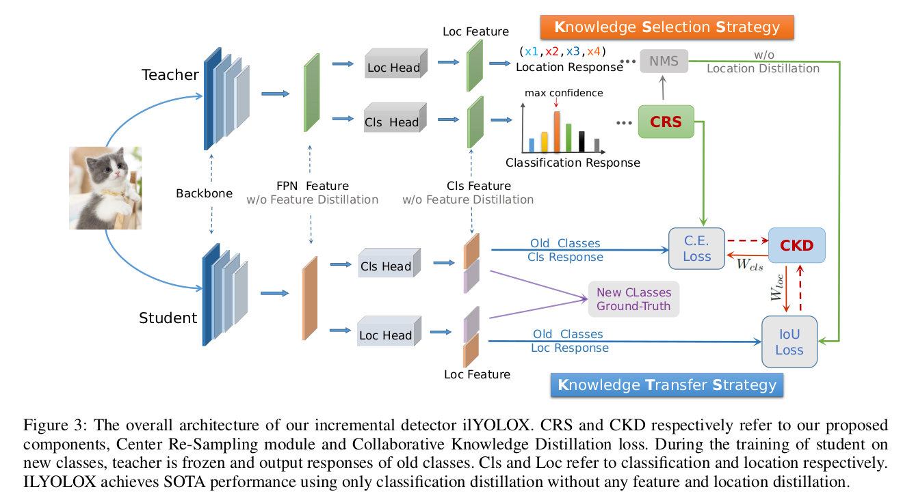

## Incremental (Continual) Object Detection Frame based on MMDetection

# Center Resampling and Collaborative Knowledge Distillation Strategies for Class Incremental Object Detection

MMDetection is an open source object detection toolbox based on PyTorch. It is
a part of the [OpenMMLab](https://openmmlab.com/) project.

The master branch works with **PyTorch 1.5+**.

[](https://pypi.org/project/mmdet)
[](https://mmdetection.readthedocs.io/en/latest/)
[](https://codecov.io/gh/open-mmlab/mmdetection)
[](https://github.com/open-mmlab/mmdetection/blob/master/LICENSE)
[](https://github.com/open-mmlab/mmdetection/issues)


## 1. Abstract
Catastrophic forgetting is the key problem in Class Incremental Object Detection(CIOD) task. 
Knowledge distillation has been proved to be an effective way to solve this problem.However, 
most previous works need to combine several distillation methods including feature, 
classification and location to work together.In this paper, our method only uses classification 
distillation. First, an adaptive structured knowledge selection strategy is proposed to enhance 
the excavation of detection knowledge from teacher model. Second, a collaborative knowledge 
transfer strategy is proposed to enhance the knowledge transfer from teacher model to student 
model. We demonstrate that the reasonable selection and transfer strategy is the key to overcome 
catastrophic forgetting for CIOD task. Extensive experiments conducted on COCO2017 demonstrate 
that our method achieves state-of-the-art results under various scenarios, which gives a remarkable 
relative improvement by a large margin than the previous best results under multi-steps incremental 
learning. Code is available at https://github.com/zhjpqq/ILYOLOX.


## 2. Network Architecture1111111





## 3. Overall Performance

[comment]: <> (![ilyolox/coco-mlti-step-il.png]&#40;ilyolox/coco-mlti-step-il.png&#41;)


###**ERD is proposed at CVPR 2022: [Overcoming Catastrophic Forgetting in Incremental Object Detection via Elastic Response Distillation](https://arxiv.org/abs/2204.02136).** 


[comment]: <> (![ilyolox/coco-2xsteps.png]&#40;ilyolox/coco-2xsteps.png&#41;)


## 4. Traing & Evaluation

```
nohup tools/dist_train_increment.sh 1>$expdir/common_exp_il/nohup 2>&1 &
```

```
tools/xdist_test.sh
```

## 5. Checkpoint Dowload

Google Drive Preparing!  


## 6. License

This project is released under the [Apache 2.0 license](LICENSE).
