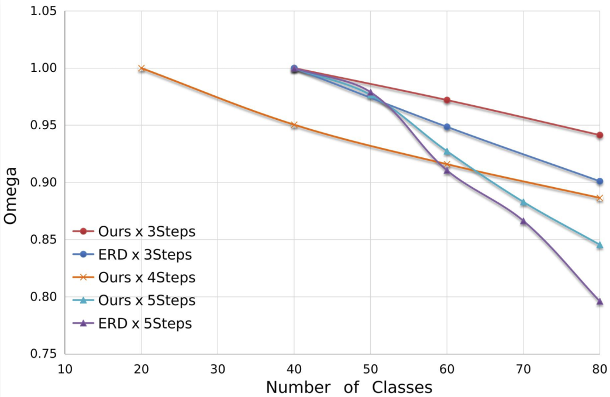

<div align="center">
  
  <div>&nbsp;</div>
  <div align="center">
    <b>OpenMMLab website</b>
    <sup>
      <a href="https://openmmlab.com">
        <i>HOT</i>
      </a>
    </sup>
    &nbsp;&nbsp;&nbsp;&nbsp;
    <b>OpenMMLab platform</b>
    <sup>
      <a href="https://platform.openmmlab.com">
        <i>TRY IT OUT</i>
      </a>
    </sup>
  </div>
  <div>&nbsp;</div>

[](https://pypi.org/project/mmdet)
[](https://mmdetection.readthedocs.io/en/latest/)
[](https://codecov.io/gh/open-mmlab/mmdetection)
[](https://github.com/open-mmlab/mmdetection/blob/master/LICENSE)
[](https://github.com/open-mmlab/mmdetection/issues)

  

[📘Documentation](https://mmdetection.readthedocs.io/en/v2.21.0/) |
[🛠️Installation](https://mmdetection.readthedocs.io/en/v2.21.0/get_started.html) |
[👀Model Zoo](https://mmdetection.readthedocs.io/en/v2.21.0/model_zoo.html) |
[🆕Update News](https://mmdetection.readthedocs.io/en/v2.21.0/changelog.html) |
[🚀Ongoing Projects](https://github.com/open-mmlab/mmdetection/projects) |
[🤔Reporting Issues](https://github.com/open-mmlab/mmdetection/issues/new/choose)

</div>

## Incremental(Continual) Object Detection Frame based on MMDetection

MMDetection is an open source object detection toolbox based on PyTorch. It is
a part of the [OpenMMLab](https://openmmlab.com/) project.

The master branch works with **PyTorch 1.5+**.

## Incremental YOLOX





## Traing & Evaluation

```
nohup tools/dist_train_increment.sh 1>$expdir/common_exp_il/nohup 2>&1 &
```

```
tools/xdist_test.sh
```

## Checkpoint Dowload

Google Drive Preparing!

## License

This project is released under the [Apache 2.0 license](LICENSE).
